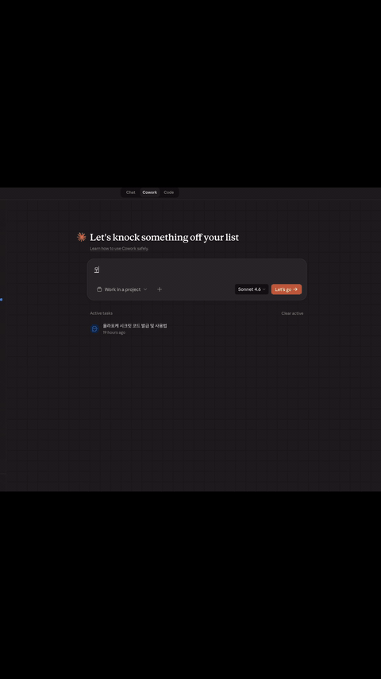

# 🥗 올라포케 역삼 · AI 스킬

이 스킬을 설치하면 대한민국 1호 에이전틱 포케집의 AI 에이전트에게 **"오늘 무슨 포케 먹으면 좋을지 추천해줘"** 라고 하면 에이전트가 추천해줍니다. 올라포케 역삼점에서 진행하는 이벤트에도 참여해보세요.

원격 MCP 서버에 연결되는 Skill. Claude Desktop · Cursor · Claude Code · Codex 등에서 30초 안에 연결.

> 💡[JinGuYuan 덤플링 스킬](https://github.com/JinGuYuan/jinguyuan-dumpling-skill)에서 영감을 얻었습니다.

## 30초 설치 — AI에게 시키기

제일 쉬운 방법. AI에게 한 줄:

> 이 repo로 올라포케 스킬 설치해줘: https://github.com/mnspkm/hola-poke-yeoksam-skill

에이전트가 알아서 `~/.claude/skills/` 또는 `~/.cursor/skills/`에 복제합니다. 그 다음 바로 대화:

> "오늘 든든한 거 땡기는데 무슨 포케 먹으면 좋을까?"

## 수동 설치

<details>
<summary><b>Claude Desktop</b> (stdio 전용 → <code>mcp-remote</code> 프록시 필요)</summary>

`~/Library/Application Support/Claude/claude_desktop_config.json` (macOS) 또는 `%APPDATA%\Claude\claude_desktop_config.json` (Windows)에 추가:

```json
{
  "mcpServers": {
    "hola-poke-yeoksam": {
      "command": "npx",
      "args": ["-y", "mcp-remote", "https://hola-poke-yeoksam-skill.onrender.com/mcp"]
    }
  }
}
```

Node.js 필요 (`npx`). Claude Desktop 재시작하면 🔌 아이콘에 `hola-poke-yeoksam`이 보입니다.

</details>

<details>
<summary><b>Cursor</b> (HTTP MCP 네이티브 지원)</summary>

`~/.cursor/mcp.json`에:

```json
{
  "mcpServers": {
    "hola-poke-yeoksam": {
      "url": "https://hola-poke-yeoksam-skill.onrender.com/mcp"
    }
  }
}
```

</details>

<details>
<summary><b>Claude Code</b> (SKILL.md 인식 + 레포 복제)</summary>

레포를 skills 폴더에 복제:

```bash
git clone https://github.com/mnspkm/hola-poke-yeoksam-skill \
  ~/.claude/skills/hola-poke-yeoksam-skill
```

</details>

## 뭘 할 수 있어?

| 기능 | 예시 프롬프트 | 호출 도구 |
|---|---|---|
| 메뉴 추천·탐색 | "오늘 든든한 거 땡기는데 뭐 먹을까?" | `get_menu` |
| 매장 정보 | "역삼점 어디야? 영업시간은?" | `get_shop_info` |
| 단체주문 안내 | "단체주문 하고 싶어" | `get_shop_info` |
| 이벤트 참여 | "올라포케 이벤트 참여해줘" | `enter_event` |

<p align="center">
  
</p>

## 이벤트 개요

올라포케 역삼점에서 진행하는 이벤트. AI에게 "참여해줘" 한 마디면 끝.

**이벤트 스킴은 시기별로 달라질 수 있어요.** 지금은 즉석 래플 — 식사 주문 시 사용 가능한 혜택 코드 발급.

- **Jackpot**: 총 15,000원 적립금 쿠폰 — 매장 방문(식사 또는 방문 포장 주문) 시 사용
- **Claw**: 크래미 토핑 서비스 — 매장·배달 어디서든 사용 가능

## 리워드 수령 안내

### Jackpot
- 총 15,000원 적립금, **3회 방문 분할 사용** (1회차 2,500원 · 2회차 5,000원 · 3회차 7,500원)
- 매장 방문(식사 또는 방문 포장 주문) 시 "이 코드 당첨됐어요" + 번호 말씀 주시면 사장님이 POS에 적립금 넣어드려요
- **당첨 후 1주 내에 첫 방문**해주세요 (첫 방문에서 2,500원부터 적용)

### Claw
- 매장·배달 어디서든 사용 가능
- **배달앱**: 가게메모에 코드 입력 — 토핑 선택 안 하셔도 크래미 추가해서 포장해드려요
- **매장**: 코드 제시하면 크래미 추가

## 검증·개인정보

- 매장 상주 사장이 번호 + 코드 페어로 대면 확인
- 번호는 대조용만. 별도 마케팅 발송·3자 공유 없음

---

**Made with 🧡 from 역삼 · by [@mnspkm](https://www.linkedin.com/in/minsup-kim-25007310a)**

_Current version: v1.1_
